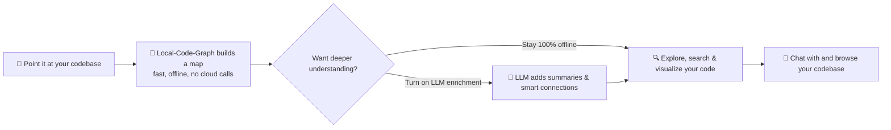
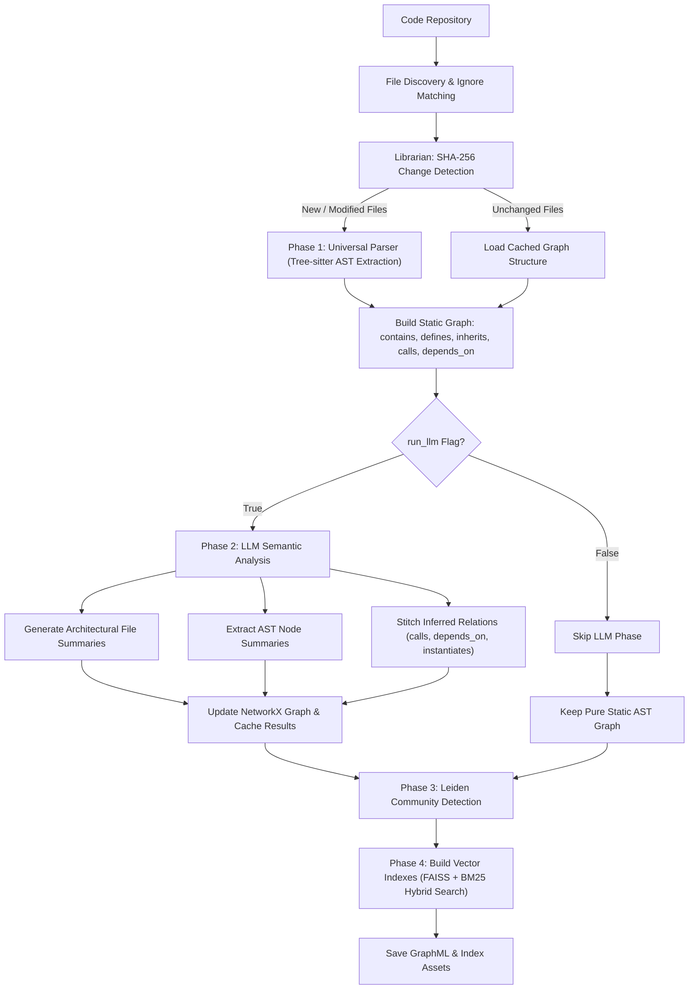
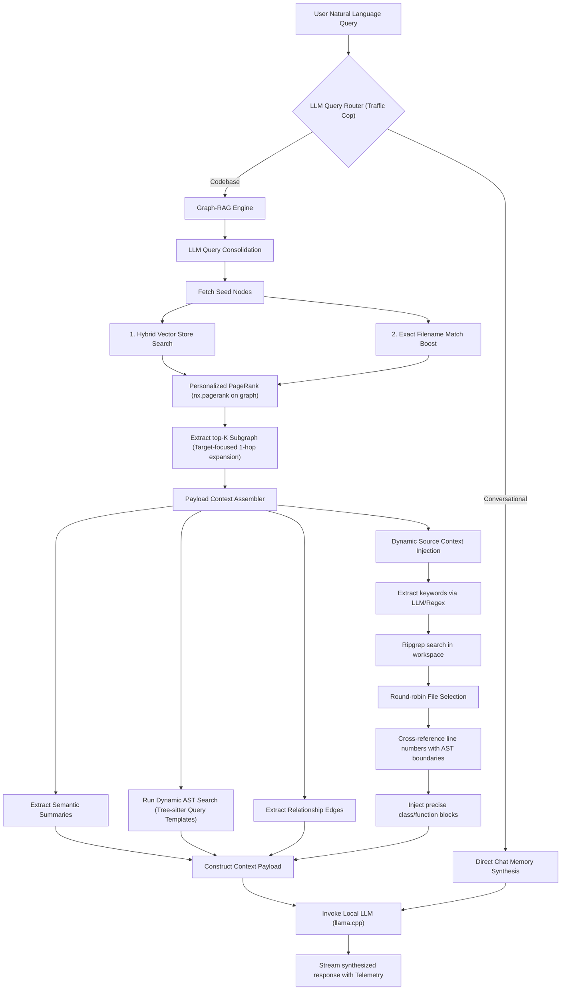

# Local-Code-Graph
### *A local, private map of your codebase — and the foundation for whatever repository-intelligence tools come next.*


---

## 🧭 What is this, really?

Point Local-Code-Graph at a folder of code, and it builds a **live map** of that codebase — files, classes, functions, and how they all connect — entirely on your machine. Nothing leaves your laptop unless you explicitly wire up a cloud model.

You can then **search it, visualize it, and chat with it**. Turning on LLM enrichment makes that map smarter (rich summaries, inferred relationships), but it's optional — the structural map itself works fully offline, for free, with zero API calls.



### Where this is headed

This project started as a local Graph-RAG (Retrieval-Augmented Generation) experiment — and retrieval-augmented chat is still one of the things it does well. But that's no longer the whole point. The goal now is a general-purpose **repository intelligence** layer: a persistent, structural, and semantic understanding of your code that a growing set of tools and agents can build on top of — not just a chatbot bolted onto your files. RAG is one consumer of the graph, not the identity of the project.

---

## 🚀 Key Features

* **100% Local Inference possible:** Powered by `llama.cpp`, `langchain` and Semantic Kernel, routing to your local GPU (optimized for models like Gemma 4 or Qwen3.5).

   *Though on changing `.env` keys, cloud models like Gemini, OpenAI, DeepSeek will also be accessible for this excluding enterprise cloud ones.*
* **Codebase Semantic Mapping:** Uses `networkx` to build a structural and semantic GraphML representation of your repository, understanding how files and classes interact.
* **Dynamic Sub-Graph Retrieval:** Prevents memory bandwidth bottlenecks (KV Cache overflow) by extracting only the Top-K relevant nodes and their 1-hop neighbors before invoking the LLM.
* **Asynchronous Ingestion Worker:** Heavy AST parsing, Leiden community clustering, and graph querying are offloaded to background threads. The FastAPI event loop remains unblocked, providing extremely low-latency routing and ingestion orchestration.
* **Parallel LLM Analysis:** During Phase 2 knowledge graph enrichment, multiple LLM requests are batched and executed concurrently (via semaphores and `asyncio.gather`), drastically reducing overall indexing time.
* **Graph Caching:** Prevents redundant XML parsing across queries by caching the parsed networkx graph in memory.
* **Streaming Streamlit UI:** A responsive chat interface that natively parses and renders fragmented JSON-Lines streams.
* **Reasoning Tag Parser:** Includes a custom state-machine to perfectly intercept and render `<think>` tags from reasoning models into clean Markdown blockquotes.
* **Real-Time Telemetry:** Tracks and displays generation stats (Tokens Per Second, Time Taken, Prompt vs. Generated Tokens) instantly in the UI.

### Ingestion (without LLM)

### Ingestion (with LLM summarization)


---

## 🔄 Deep Dive: Ingestion & Retrieval Pipelines

The system supports two core operation modes: **Static AST-Only (Fast, Local, Free)** and **LLM-Enriched (Deep Semantic RAG)**.

### 🔌 Ingestion: With vs. Without LLM

| Phase / Feature | 🪵 Without LLM (Static AST Mode) | 🧠 With LLM (Enriched Semantic Mode) |
| :--- | :--- | :--- |
| **Parsing Mechanism** | Local **Tree-sitter** AST extraction for classes, functions, and imports. | Local **Tree-sitter** AST extraction + semantic batch analysis. |
| **Speed & Cost** | Sub-second execution, 100% free, runs entirely on CPU. | Concurrently batched (Semaphore limit = 5); takes seconds to minutes; requires LLM API/Local GPU inference. |
| **Node Summaries** | Nodes in the graph remain unsummarized (empty/pending descriptions). | The LLM parses code modules and writes rich architectural summaries directly to nodes. |
| **Relationship Stitching** | Maps explicit relationships: `contains` (parent file/class), `defines`, `inherits` (base classes), `depends_on` (static imports). | **Stitches implicit relationships** by reasoning over call hierarchies and data flow to add `calls` (inferred), `depends_on` (inferred), and `instantiates` (inferred) edges with confidence ratings. |
| **Retrieval Power** | Relies on exact keyword matches, filename matching, and structural traversals. | Fully unlocks hybrid FAISS/BM25 vector search over LLM-generated semantic summaries, followed by Personalized PageRank (PPR) traversal. |

#### Ingestion Flow Architecture


---

### 🔍 Retrieval: Context Synthesis Flow

When a user submits a natural language query, the **Retrieval Pipeline** acts as an intelligent compiler to assemble a hyper-relevant context payload for the generation LLM, avoiding KV Cache overflow and prompt noise.

1. **The Traffic Cop (Query Router):** A lightweight LLM checks if the query is conversational (uses chat history) or codebase-related (requires Graph-RAG).
2. **Query Consolidation:** If codebase-related, the query is combined with history into a single standalone prompt.
3. **PPR Seed Selection:**
   - **Dense/Sparse Search:** Matches the query against node summaries using FAISS + BM25 hybrid search.
   - **Keyword Boosting:** Checks query words against node file/symbol names, giving a heavy score boost (`+50` / `+300`) to exact matches.
4. **Personalized PageRank (PPR):** Spreads score importance through graph edges (both static and LLM-inferred edges) using `nx.pagerank` with personalization vectors starting at the seed nodes. This pulls in "1-hop" neighbors and structurally important modules.
5. **Dynamic AST-Scoped Context Builder:**
   - Instead of injecting whole files (which wastes context and degrades retrieval accuracy), the system cross-references the matching search lines with the exact AST node boundaries from the graph.
   - **Source Code Injection:** Only the specific class or function code block is extracted and injected into the prompt.
   - **Fallback Snippets:** For unstructured files (like shell scripts or small JSON configs), it grabs local ±15 line windows around matched terms.

#### Retrieval Flow Architecture


---

## 🎨 Interactive Visualizations (2D & 3D Maps)

The dashboard contains an interactive graph viewer under the `🕸️ Interactive Architecture Map` tab that renders the codebase topology generated by Leiden clustering.

### Navigation & Views
* **Clustering Levels:**
  * **Macro-Communities:** Clusters code files into broader systems/packages based on high-level dependencies.
  * **Micro-Communities:** Recursively sub-clusters macro groups into smaller, fine-grained module/class-level groupings.
* **Organic (Physics) vs. Hierarchical:** Toggle between a force-directed organic layout or a top-down `Hierarchical (Tree)` layout representing structural containment.


* **🌌 3D Hyperspace Mode:** Check the `🌌 Enable 3D Hyperspace` toggle to render the graph in a 3D force-directed canvas. *This is a bit resource intensive, so loading can take upto 20 seconds.*
  * **Rotate:** Left-Click & Drag.
  * **Zoom:** Scroll-Wheel.
  * **Pan:** Right-Click & Drag (or Shift + Left-Click & Drag).
  * **2D-to-3D Flyto Handoff:** Selecting a node in 2D and checking the 3D box automatically flies the 3D camera to focus directly on that element.


### Node Color & Sizing
* **Size:** Represents "hubness" (degree). Nodes with more incoming and outgoing connections are rendered larger.
* **Shape:** Source files, classes, and functions are rendered as circles (`dot`). Configurations and package managers (like `.json`, `.toml`, `.yaml`, `.txt`) are rendered as prominent orange squares.

---

## 📐 Edge Relationship Styling Reference

The connections between code elements are styled dynamically to signify the nature and origin of the relationship:

| Relation | Origin Type | Vis.js Edge Color | Line Width | Line Style | Description |
| :--- | :--- | :--- | :--- | :--- | :--- |
| **`contains`** | Extracted | `#718096` (Grey) | 1.0 (Thin) | **Dashed** | File contains a class or global function |
| **`defines`** | Extracted | `#4A5568` (Dark Grey) | 1.0 (Thin) | **Solid** | Class defines a method/function |
| **`calls`** | Extracted | `#3182ce` (Blue) | 2.0 (Medium) | **Solid** | Function calls another function |
| **`calls`** | Inferred | `#3182ce` (Blue) | 2.0 (Medium) | **Dashed** | LLM-inferred method call |
| **`depends_on`**| Extracted | `#dd6b20` (Gold) | 3.0 (Thick) | **Solid** | Explicit module import (`import X`) |
| **`depends_on`**| Inferred | `#dd6b20` (Gold) | 3.0 (Thick) | **Dashed** | LLM-inferred dependency |
| **`instantiates`**| Inferred | `#38a169` (Green) | 1.5 (Medium-Thin) | **Dashed** | Class instantiates another class |
| **`inherits`** | Extracted | `#805ad5` (Purple) | 2.0 (Medium) | **Solid** | Class subclassing/inheritance |

---

## 🔍 AST Search Explorer

The `🔍 AST Search Explorer` provides a structured workspace inspector utilizing two distinct search paradigms:

1. **Graph Metadata Search:**
   * Queries the pre-built NetworkX graph database using structural metadata filters:
     * **Node Type:** Filter by `file`, `class`, or `function`.
     * **Name String:** Substring-match specific code symbols.
     * **Inherits from class:** Searches incoming inheritance relationships.
     * **Calls symbol:** Finds elements that call or reference a target method.
2. **Dynamic Tree-sitter Pattern Search:**
   * Scans target files matching selected extensions (`.py`, `.js`, `.ts`, `.tsx`) on-the-fly using tree-sitter.
   * Provides predefined templates (`exception_handlers`, `decorators`, `async_functions`, `try_catch`, `interfaces`).
   * Supports **Custom S-Expression Queries** (e.g., `(except_clause) @match` or `(function_definition) @match`) to inspect code structure dynamically.

---

## ⚡ Search & Token Optimizations

To prevent prompt context window overflow (exceeding context boundaries) and reduce retrieval noise, a precision search filter is active:

1. **LLM-Based Keyword Extraction Agent:** 
   * Search queries are intercepted by a lightweight extraction LLM. It extracts specific class names, function names, library imports, and filenames (e.g., `blood_v1.py`) and discards search noise (like `compare`, `iterations`, `find`), preventing ripgrep keyword search pollution.
2. **AST-Scoped Code Injection:**
   * Exact match line hits are cross-referenced with the graph database. Instead of injecting whole files into the LLM prompt, only the code blocks of the specific containing AST nodes (the exact function or class ranges) are retrieved and injected.
3. **Global & Flat File fallbacks:**
   * Match lines outside AST ranges (e.g. global imports) are injected as compact context snippets (±5 lines).
   * Script files that contain no class/function declarations (like `blood.py`) are fully injected if small (< 20 KB), or retrieved as localized ±15-line snippets if large.
4. **HTML & JSON Snippet Protection:**
   * Large visualizer templates (`debug_rendered.html`) or graph caches (`graph.json`) are blocked from raw injection. Small JSON configs (< 5 KB) are fully read, while larger ones or HTML files extract localized ±5-line snippets around the exact matches.
5. **Balanced Search Scoring:**
   * Filename and explicit code symbol matches receive a balanced score boost (+50), ensuring target files and classes are ranked high alongside semantic vector similarity scores without overriding PageRank logic.

---

## 💻 Tech Stack

* **Frontend:** Streamlit, Requests, vis.js, 3D-Force-Graph (WebGL)
* **Backend:** FastAPI, Uvicorn, Semantic Kernel, NetworkX, Leiden Community Clustering, tree-sitter
* **Local Inference:** llama.cpp, Gemma 4 (Reasoning Model)

---

## ⚙️ Getting Started

### Prerequisites
* Python 3.12+
* [uv](https://github.com/astral-sh/uv) package manager
* `llama.cpp` (`llama-server`) installed and accessible in your path.

### Unified Bootstrapping (`./start.sh`)

To simplify launching the private local intelligence ecosystem, use the unified startup script:

```bash
# Make the script executable
chmod +x start.sh

# Start all services
./start.sh
```

The script boots:
1. **Local Inference Server:** `llama-server` on port `8080` loading your GGUF model with GPU offloading and a high context limit (`131072`).
2. **FastAPI Backend:** Runs on http://localhost:8000.
3. **Streamlit UI:** Runs on http://localhost:8501 (if not blocked on port 8501).

*Note: Pressing `Ctrl+C` triggers a shell trap that gracefully shuts down all background processes.*

If you prefer starting services individually, run them in separate terminal windows:

1. **Boot the LLM Engine:**

You can also use `Multi-Token Prediction (MTP)` models for faster inference using speculative decoding. The quality of output remains almost same with upto 3-4x faster token output on relevant hardware-model combination.

*`Do check `*[llm_benchmark.md](docs/llm_benchmark.md)*` for benchmark result of different models with Multi-Token Prediction (MTP)`*
   ```bash
   cd ~/llama.cpp/build
   ./bin/llama-server -m ~/llmhost/model/gemma-4-E4B-it-Q4_K_M.gguf -ngl 999 -c 131072 -fa on -ctk q4_0 -ctv q4_0 --host 0.0.0.0 --port 8080 --jinja --pooling rank
   ```
2. **Start the Backend API:**
   ```bash
   uv run main.py
   ```
3. **Launch the Streamlit UI:**
   ```bash
   uv run streamlit run app.py
   ```

---

## 🙏 Acknowledgments

The initial spark for this project came from seeing [**graphify**](https://github.com/safishamsi/graphify) by [safishamsi](https://github.com/safishamsi) — an AI coding assistant skill for Claude Code, Codex, OpenCode, Cursor, Gemini CLI, and more. Seeing that idea — giving coding agents a structural sense of a repository — is what got me thinking about this space.

**Local-Code-Graph is not a fork, a port, or a derivative of graphify.** It's an independent project, built from scratch around a different architecture and a different set of problems: a FastAPI + Streamlit service (not an editor/CLI skill as of now), a persistent NetworkX/GraphML graph store, multi-language Tree-sitter AST extraction with two-pass static call resolution, Leiden community clustering for macro/micro topology, hybrid FAISS + BM25 retrieval with Personalized PageRank subgraph expansion, and a fully local inference path via `llama.cpp`. None of graphify's code or prompts was copied — credit here is for the inspiration.

If you're exploring this space, graphify is well worth a look in its own right.

---

### Additions worth looking into / pending:
1. Temporal Git
2. Better tools and agents for precision/wider variety tasks.
3. CLI based run for usage.
4. Multi-modal processing for e.g. PDFs, audio files, .mds etc.
5. Online search agent.